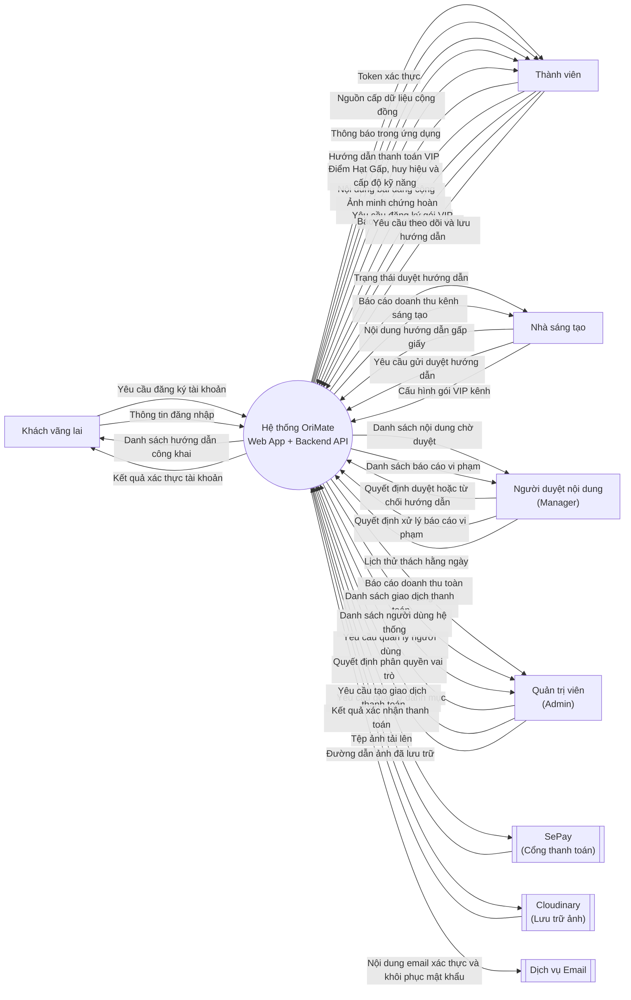

# Sơ đồ ngữ cảnh hệ thống OriMate (DFD Level 0)

> Phạm vi: toàn bộ logic Frontend (Next.js, `orimate-web`) và Backend (ASP.NET Core, `OriMate API`) được gộp chung thành **một** hệ thống trung tâm duy nhất. Dữ liệu được rút ra từ mã nguồn thực tế trong `lib/api/*`, `app/_components/*`, `next.config.ts`, `RENDERING_STRATEGY.md`.

---

## Phần 1: Dữ liệu cấu trúc (Data File)

```json
{
  "systemName": "Hệ thống OriMate (Web App + Backend API)",
  "externalEntities": [
    {
      "id": "KV",
      "name": "Khách vãng lai",
      "type": "human_actor",
      "description": "Người dùng chưa đăng nhập, chỉ xem được nội dung công khai."
    },
    {
      "id": "TV",
      "name": "Thành viên",
      "type": "human_actor",
      "description": "Người dùng đã đăng ký, tương tác với cộng đồng, thử thách, gói VIP."
    },
    {
      "id": "NST",
      "name": "Nhà sáng tạo",
      "type": "human_actor",
      "description": "Thành viên có kênh riêng, đăng hướng dẫn, mở gói VIP kênh, xem doanh thu."
    },
    {
      "id": "ND",
      "name": "Người duyệt nội dung (Manager)",
      "type": "human_actor",
      "description": "Kiểm duyệt hướng dẫn, bài đăng, báo cáo vi phạm, lịch thử thách."
    },
    {
      "id": "QTV",
      "name": "Quản trị viên (Admin)",
      "type": "human_actor",
      "description": "Toàn quyền quản trị: người dùng, phân quyền, doanh thu toàn nền tảng, danh mục."
    },
    {
      "id": "SEPAY",
      "name": "SePay",
      "type": "external_system",
      "description": "Cổng thanh toán chuyển khoản/QR, xác nhận giao dịch qua webhook gửi tới backend."
    },
    {
      "id": "CLOUDINARY",
      "name": "Cloudinary",
      "type": "external_system",
      "description": "Dịch vụ lưu trữ và tối ưu hình ảnh (CDN)."
    },
    {
      "id": "EMAIL",
      "name": "Dịch vụ Email",
      "type": "external_system",
      "description": "Gửi email xác thực tài khoản và khôi phục mật khẩu do backend kích hoạt."
    }
  ],
  "dataFlows": [
    { "from": "KV", "to": "SYSTEM", "label": "Yêu cầu đăng ký tài khoản" },
    { "from": "KV", "to": "SYSTEM", "label": "Thông tin đăng nhập" },
    { "from": "SYSTEM", "to": "KV", "label": "Danh sách hướng dẫn công khai" },
    { "from": "SYSTEM", "to": "KV", "label": "Kết quả xác thực tài khoản" },

    { "from": "TV", "to": "SYSTEM", "label": "Nội dung bài đăng cộng đồng" },
    { "from": "TV", "to": "SYSTEM", "label": "Ảnh minh chứng hoàn thành thử thách" },
    { "from": "TV", "to": "SYSTEM", "label": "Yêu cầu đăng ký gói VIP" },
    { "from": "TV", "to": "SYSTEM", "label": "Báo cáo vi phạm nội dung" },
    { "from": "TV", "to": "SYSTEM", "label": "Yêu cầu theo dõi và lưu hướng dẫn" },
    { "from": "SYSTEM", "to": "TV", "label": "Token xác thực" },
    { "from": "SYSTEM", "to": "TV", "label": "Nguồn cấp dữ liệu cộng đồng" },
    { "from": "SYSTEM", "to": "TV", "label": "Thông báo trong ứng dụng" },
    { "from": "SYSTEM", "to": "TV", "label": "Hướng dẫn thanh toán VIP" },
    { "from": "SYSTEM", "to": "TV", "label": "Điểm Hạt Gấp, huy hiệu và cấp độ kỹ năng" },

    { "from": "NST", "to": "SYSTEM", "label": "Nội dung hướng dẫn gấp giấy" },
    { "from": "NST", "to": "SYSTEM", "label": "Yêu cầu gửi duyệt hướng dẫn" },
    { "from": "NST", "to": "SYSTEM", "label": "Cấu hình gói VIP kênh" },
    { "from": "SYSTEM", "to": "NST", "label": "Trạng thái duyệt hướng dẫn" },
    { "from": "SYSTEM", "to": "NST", "label": "Báo cáo doanh thu kênh sáng tạo" },

    { "from": "ND", "to": "SYSTEM", "label": "Quyết định duyệt hoặc từ chối hướng dẫn" },
    { "from": "ND", "to": "SYSTEM", "label": "Quyết định xử lý báo cáo vi phạm" },
    { "from": "ND", "to": "SYSTEM", "label": "Lịch thử thách hằng ngày" },
    { "from": "SYSTEM", "to": "ND", "label": "Danh sách nội dung chờ duyệt" },
    { "from": "SYSTEM", "to": "ND", "label": "Danh sách báo cáo vi phạm" },

    { "from": "QTV", "to": "SYSTEM", "label": "Yêu cầu quản lý người dùng" },
    { "from": "QTV", "to": "SYSTEM", "label": "Quyết định phân quyền vai trò" },
    { "from": "QTV", "to": "SYSTEM", "label": "Yêu cầu quản lý danh mục" },
    { "from": "SYSTEM", "to": "QTV", "label": "Báo cáo doanh thu toàn nền tảng" },
    { "from": "SYSTEM", "to": "QTV", "label": "Danh sách giao dịch thanh toán" },
    { "from": "SYSTEM", "to": "QTV", "label": "Danh sách người dùng hệ thống" },

    { "from": "SYSTEM", "to": "SEPAY", "label": "Yêu cầu tạo giao dịch thanh toán" },
    { "from": "SEPAY", "to": "SYSTEM", "label": "Kết quả xác nhận thanh toán" },

    { "from": "SYSTEM", "to": "CLOUDINARY", "label": "Tệp ảnh tải lên" },
    { "from": "CLOUDINARY", "to": "SYSTEM", "label": "Đường dẫn ảnh đã lưu trữ" },

    { "from": "SYSTEM", "to": "EMAIL", "label": "Nội dung email xác thực và khôi phục mật khẩu" }
  ]
}
```

---

## Phần 2: Mã render sơ đồ trực quan (Mermaid)



---

### Ghi chú kỹ thuật (căn cứ phân tích mã nguồn)

- **Kiến trúc thực tế**: `orimate-web` là Next.js frontend thuần, không có `app/api/**`. Mọi request `/api/*` được `next.config.ts` proxy tới backend ASP.NET Core (`NEXT_PUBLIC_API_URL`) — do đó BE + FE được gộp làm một hệ thống theo đúng yêu cầu đề bài.
- **SePay**: webhook xác nhận thanh toán đáp xuống backend (không phải trực tiếp trình duyệt); FE chỉ hiển thị mã QR/số tài khoản và polling trạng thái giao dịch (`lib/api/subscriptions.ts`).
- **Cloudinary**: trình duyệt gửi file thô lên backend (`POST /api/uploads/image`), backend mới là bên gọi Cloudinary và trả về URL (`lib/api/uploads.ts`).
- **Dịch vụ Email**: không có mã gửi email trong repo frontend; suy ra từ các luồng `forgotPassword`/`verifyEmail`/`resendVerification` trong `lib/api/auth.ts` — trách nhiệm gửi email thuộc về backend.
- **Vai trò người dùng**: lấy từ trường `roles: string[]` trả về sau đăng nhập — gồm `User`, `Creator` (ngầm định), `Manager`, `Admin` (xem `app/(dashboard)/admin/layout.tsx`, `AdminUsersPage.tsx`).
